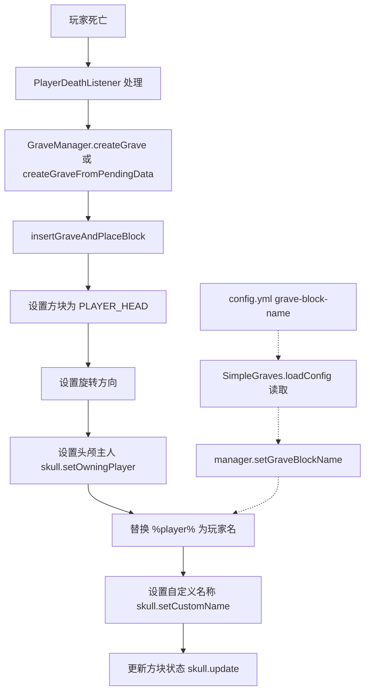

# 墓碑头颅方块名称可配置化方案

## 目标

使放置的 `PLAYER_HEAD` 墓碑方块拥有一个自定义名称（即游戏内准星指向时显示的名称），该名称可通过 `config.yml` 配置，默认值为 `"%player%'s Grave"`，并支持 `%player%` 占位符动态替换为玩家名。

## 背景分析

在 [`GraveManager.java`](src/main/java/com/pixelcatt/simplegraves/GraveManager.java) 的 `insertGraveAndPlaceBlock()` 方法（第 227-236 行）中，墓碑头颅方块按以下流程放置：

```java
// 第 228-236 行
Block block = loc.getBlock();
block.setType(Material.PLAYER_HEAD);
Rotatable rot = (Rotatable) block.getBlockData();
rot.setRotation(graveRotation);
block.setBlockData(rot);

Skull skull = (Skull) block.getState();
skull.setOwningPlayer(player);
skull.update();
```

当前代码**没有**设置自定义名称。在 Spigot 1.21 API 中，`Skull`（继承自 `BlockState` 实现 `Nameable`）提供了 `setCustomName(String name)` 方法，用于设置方块上显示的自定义名称。

## 修改方案

### 涉及文件

| 文件 | 修改内容 |
|------|----------|
| [`src/main/resources/config.yml`](src/main/resources/config.yml) | 添加 `grave-block-name` 配置项 |
| [`src/main/java/com/pixelcatt/simplegraves/SimpleGraves.java`](src/main/java/com/pixelcatt/simplegraves/SimpleGraves.java) | 读取配置并传递给 `GraveManager` |
| [`src/main/java/com/pixelcatt/simplegraves/GraveManager.java`](src/main/java/com/pixelcatt/simplegraves/GraveManager.java) | 存储名称模板，在放置方块时应用 |

### 步骤 1: config.yml 添加配置项

在 [`src/main/resources/config.yml`](src/main/resources/config.yml) 的通用设置区（例如在 `non-grave-player-head-water-protection` 之后）添加：

```yaml
# Custom Name for the Grave Block (Default: "%player%'s Grave")
# Use %player% as a placeholder for the Player Name
grave-block-name: "%player%'s Grave"
```

位置建议：放在第 21 行 `non-grave-player-head-water-protection` 之后、第 24 行 `# Database Settings` 之前。

### 步骤 2: SimpleGraves.java 读取配置

在 [`SimpleGraves.java`](src/main/java/com/pixelcatt/simplegraves/SimpleGraves.java) 的 `loadConfig()` 方法中，添加对 `grave-block-name` 的读取，并传递给 `GraveManager`。

在 `loadConfig()` 方法末尾（`saveConfig()` 之前），添加：

```java
String graveBlockName = config.getString("grave-block-name", "%player%'s Grave");
manager.setGraveBlockName(graveBlockName);
config.set("grave-block-name", graveBlockName);
```

### 步骤 3: GraveManager.java 存储和应用名称模板

在 [`GraveManager.java`](src/main/java/com/pixelcatt/simplegraves/GraveManager.java) 中：

**a) 添加字段：**
```java
private String graveBlockName = "%player%'s Grave";
```

**b) 添加 Setter 方法：**
```java
public void setGraveBlockName(String graveBlockName) {
    this.graveBlockName = graveBlockName;
}
```

**c) 修改 `insertGraveAndPlaceBlock()` 方法**，在设置 skull owner 之后（第 235 行 `skull.setOwningPlayer(player)` 之后，第 236 行 `skull.update()` 之前），添加自定义名称设置：

```java
// 设置自定义名称
String displayName = graveBlockName.replace("%player%", player.getName());
skull.setCustomName(displayName);
```

## 工作流程图



## 注意事项

1. **占位符格式**：使用 `%player%` 以保持与插件其他消息系统一致（如 `messages.cmd.no_grave_other` 中使用 `%player%`）。
2. **默认值**：`"%player%'s Grave"` 在代码中硬编码为回退默认值，与 config.yml 保持一致。
3. **API 兼容性**：`BlockState.setCustomName(String)` 在 Spigot 1.21+ 可用，与插件目标 `api-version: 1.21` 兼容。
4. **颜色代码**：如果管理员希望在名称中使用颜色代码（如 `"§6%player%'s Grave"`），只需在配置中添加 `§` 格式代码即可，Spigot 原生支持。
5. **不涉及数据库**：此修改仅影响客户端的方块渲染状态，无需更改数据库结构。
