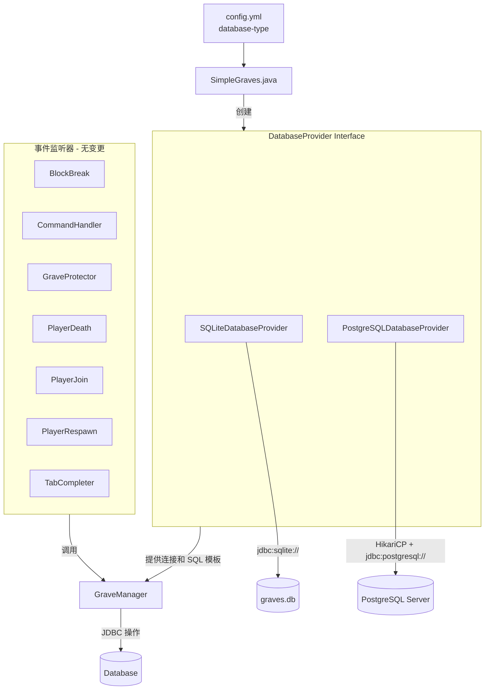

# 为 SimpleGraves 添加 PostgreSQL 支持 - 设计方案

## 1. 概述

当前插件仅支持 SQLite（通过 `sqlite-jdbc` 驱动）。目标是增加 PostgreSQL 作为备选数据库后端，使服务器管理员可在 `config.yml` 中切换数据库类型。

## 2. 架构变更

### 2.1 新增：`DatabaseProvider` 接口

创建一个抽象接口，封装数据库连接管理和数据库特定的 SQL 操作。

```java
public interface DatabaseProvider {
    void initialize(SimpleGraves plugin) throws Exception;
    Connection getConnection() throws SQLException;
    void shutdown();
    
    // 数据库特定的 DDL
    String getCreateGravesTableSQL();
    String getCreateOfflinePlayersTableSQL();
    
    // 数据库特定的 DML（处理 REPLACE INTO 等语法差异）
    String getInsertOrUpdateOfflinePlayerSQL();
}
```

### 2.2 新增：`SQLiteDatabaseProvider` 实现

将现有 SQLite 连接逻辑从 `GraveManager` 中提取出来。

- 使用文件路径 `plugins/SimpleGraves/graves.db`
- 使用 `org.sqlite.JDBC` 驱动
- JDBC URL: `jdbc:sqlite:{dbFile}`
- 连接管理方式与现有代码一致（单连接）

### 2.3 新增：`PostgreSQLDatabaseProvider` 实现

新的 PostgreSQL 数据库后端。

- 使用 `org.postgresql:postgresql` 驱动
- 使用 HikariCP 连接池 (`com.zaxxer:HikariCP`)
- JDBC URL: `jdbc:postgresql://{host}:{port}/{database}`
- 需要配置：host, port, database, username, password
- 连接池默认配置：maxPoolSize=10, minIdle=2, connectionTimeout=5000

### 2.4 修改：`GraveManager`

- 接受 `DatabaseProvider` 而非 `DatabaseWorker`
- 所有 JDBC 操作通过 `databaseProvider.getConnection()` 获取连接
- 使用 `databaseProvider.getInsertOrUpdateOfflinePlayerSQL()` 替代硬编码的 SQLite `REPLACE INTO`
- 移除直接的连接管理逻辑（`openConnection()`, `Connection connection` 字段）
- 保留所有业务逻辑（物品序列化、XP 计算、位置验证等）

### 2.5 修改：`SimpleGraves.java`

- 从 `config.yml` 读取 `database-type` 配置项
- 根据配置创建对应的 `DatabaseProvider` 实现
- 将 `DatabaseProvider` 传递给 `GraveManager`

### 2.6 修改：`config.yml`

添加数据库配置区域：

```yaml
# 数据库设置
# 支持: sqlite 或 postgresql
database-type: sqlite

# PostgreSQL 设置（仅当 database-type 为 postgresql 时使用）
postgresql:
  host: localhost
  port: 5432
  database: simplegraves
  username: simplegraves
  password: ""
  pool-settings:
    maximum-pool-size: 10
    minimum-idle: 2
    connection-timeout: 5000
```

### 2.7 修改：`pom.xml`

新增依赖：

```xml
<!-- PostgreSQL JDBC 驱动 -->
<dependency>
    <groupId>org.postgresql</groupId>
    <artifactId>postgresql</artifactId>
    <version>42.7.1</version>
</dependency>

<!-- HikariCP 连接池 -->
<dependency>
    <groupId>com.zaxxer</groupId>
    <artifactId>HikariCP</artifactId>
    <version>5.1.0</version>
</dependency>
```

更新 maven-shade-plugin 配置以 relocate 新依赖。

## 3. SQL 兼容性差异

| 特性 | SQLite | PostgreSQL |
|------|--------|------------|
| 整数类型 | `INT` | `INTEGER` |
| 浮点类型 | `DOUBLE` | `DOUBLE PRECISION` |
| 字符串类型 | `TEXT` | `VARCHAR(n)` 或 `TEXT` |
| 自增值 | `AUTOINCREMENT` | `SERIAL` / `IDENTITY` |
| 插入或更新 | `REPLACE INTO ...` | `INSERT INTO ... ON CONFLICT ... DO UPDATE SET ...` |
| 连接方式 | 文件路径 | TCP (host:port) |
| 连接池 | 不需要（单连接） | 推荐使用 HikariCP |

### 表结构对比

**grves 表**（SQLite）：
```sql
CREATE TABLE IF NOT EXISTS graves (
    uuid TEXT NOT NULL,
    grave_num INT NOT NULL,
    world TEXT NOT NULL,
    x DOUBLE NOT NULL,
    y DOUBLE NOT NULL,
    z DOUBLE NOT NULL,
    pitch DOUBLE NOT NULL,
    yaw DOUBLE NOT NULL,
    items TEXT NOT NULL,
    xp DOUBLE NOT NULL
);
```

**grves 表**（PostgreSQL）：
```sql
CREATE TABLE IF NOT EXISTS graves (
    uuid VARCHAR(36) NOT NULL,
    grave_num INTEGER NOT NULL,
    world VARCHAR(255) NOT NULL,
    x DOUBLE PRECISION NOT NULL,
    y DOUBLE PRECISION NOT NULL,
    z DOUBLE PRECISION NOT NULL,
    pitch DOUBLE PRECISION NOT NULL,
    yaw DOUBLE PRECISION NOT NULL,
    items TEXT NOT NULL,
    xp DOUBLE PRECISION NOT NULL
);
```

**offline_players 表**（SQLite）：
```sql
CREATE TABLE IF NOT EXISTS offline_players (
    uuid TEXT NOT NULL,
    plr_name TEXT NOT NULL UNIQUE,
    PRIMARY KEY(uuid)
);
```

**offline_players 表**（PostgreSQL）：
```sql
CREATE TABLE IF NOT EXISTS offline_players (
    uuid VARCHAR(36) NOT NULL,
    plr_name VARCHAR(16) NOT NULL UNIQUE,
    PRIMARY KEY(uuid)
);
```

**REPLACE INTO 转换**（SQLite → PostgreSQL）：
```sql
-- SQLite
REPLACE INTO offline_players(uuid, plr_name) VALUES (?, ?)

-- PostgreSQL
INSERT INTO offline_players(uuid, plr_name) VALUES (?, ?)
ON CONFLICT (uuid) DO UPDATE SET plr_name = EXCLUDED.plr_name
```

## 4. 代码变更清单

### 4.1 新文件

| 文件 | 说明 |
|------|------|
| `src/main/java/com/pixelcatt/simplegraves/database/DatabaseProvider.java` | 数据库提供者接口 |
| `src/main/java/com/pixelcatt/simplegraves/database/SQLiteDatabaseProvider.java` | SQLite 实现 |
| `src/main/java/com/pixelcatt/simplegraves/database/PostgreSQLDatabaseProvider.java` | PostgreSQL 实现 |

### 4.2 修改文件

| 文件 | 变更说明 |
|------|----------|
| `pom.xml` | 添加 postgresql 和 HikariCP 依赖；更新 shade 配置 |
| `src/main/resources/config.yml` | 添加数据库配置区域 |
| `src/main/java/com/pixelcatt/simplegraves/SimpleGraves.java` | 根据配置创建 DatabaseProvider |
| `src/main/java/com/pixelcatt/simplegraves/GraveManager.java` | 重构为使用 DatabaseProvider 接口 |
| `src/main/java/com/pixelcatt/simplegraves/DatabaseWorker.java` | 保持原样（异步执行器不变） |

### 4.3 不变文件

以下文件无需修改：
- `BlockBreakListener.java`
- `CommandHandler.java`
- `FoliaHelper.java`
- `GraveProtector.java`
- `MessageManager.java`
- `PlayerDeathListener.java`
- `PlayerJoinListener.java`
- `PlayerRespawnListener.java`
- `TabCompleter.java`
- `plugin.yml`

## 5. 实施步骤

### 步骤 1：创建 `database` 包和 `DatabaseProvider` 接口
- 新建包 `com.pixelcatt.simplegraves.database`
- 创建 `DatabaseProvider` 接口，包含连接管理、表创建、SQL 模板方法

### 步骤 2：实现 `SQLiteDatabaseProvider`
- 将 `GraveManager.openConnection()` 和 `GraveManager.createTables()` 中的 SQLite 逻辑迁移至此
- 提供 SQLite 专用的 SQL 模板（`REPLACE INTO` 等）

### 步骤 3：实现 `PostgreSQLDatabaseProvider`
- 使用 HikariCP 连接池管理 PostgreSQL 连接
- 提供 PostgreSQL 兼容的 SQL 模板（`INSERT ... ON CONFLICT` 等）
- 实现连接池配置读取

### 步骤 4：重构 `GraveManager`
- 构造器改为接受 `DatabaseProvider` 参数
- 所有 JDBC 操作使用 `databaseProvider.getConnection()` 获取连接
- 替换所有硬编码的 SQL 字符串为 `DatabaseProvider` 提供的方法
- 移除 `openConnection()`、`createTables()`、`Connection connection` 等字段

### 步骤 5：更新 `config.yml`
- 添加 `database-type` 配置项（默认 `sqlite`）
- 添加 PostgreSQL 连接配置块
- 添加连接池配置（可选）

### 步骤 6：更新 `SimpleGraves.java`
- 读取 `database-type` 配置
- 创建对应的 `DatabaseProvider` 实例
- 调用 `databaseProvider.initialize()`
- 将 `DatabaseProvider` 传递给 `GraveManager`

### 步骤 7：更新 `pom.xml`
- 添加 `org.postgresql:postgresql:42.7.1` 依赖
- 添加 `com.zaxxer:HikariCP:5.1.0` 依赖
- 更新 maven-shade-plugin 配置以 shade 新依赖

### 步骤 8：测试
- 编译并验证 SQLite 模式仍能正常工作
- 配置 PostgreSQL 模式并验证连接
- 验证基本的创建、查询、删除操作

## 6. 架构图



## 7. 注意事项

- 向后兼容：现有 SQLite 用户升级后无需任何配置变更（默认 `database-type: sqlite`）
- 从 SQLite 迁移到 PostgreSQL 需要手动数据迁移（超出本次任务范围）
- HikariCP 仅在 PostgreSQL 模式下使用，SQLite 模式保持简单连接方式
- `DatabaseWorker`（异步执行器）保持不变，两种数据库模式共享
