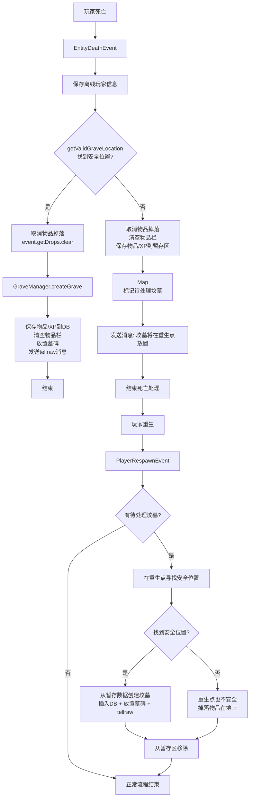

# SimpleGraves 改造方案

## 需求概述

1. **移除** `gamerule keepInventory true` 的强制设置
2. **仅当**死亡地点找不到安全位置生成坟墓时，改为在重生后的玩家脚下生成坟墓
3. **将所有聊天消息**移至配置文件以支持翻译/本地化

---

## 1. 消息清单及配置化设计

### 全部玩家可见消息（需移入 config.yml）

通过搜索，共整理出约 30 条硬编码玩家消息，按来源文件分类：

| ID | 当前硬编码消息 | 来源文件 |
|----|---------------|---------|
| `death.lucky_day` | `§aIt's your Lucky Day!` | PlayerDeathListener |
| `death.no_safe_location` | `§cSimpleGraves was unable to place your Grave!` | PlayerDeathListener |
| `death.keep_items` | `§aBecause of this, you can keep your Items!` | PlayerDeathListener |
| `death.grave_at_respawn` | `§a你的坟墓将在重生时放置于你脚下！` | PlayerDeathListener (新增) |
| `grave.failed_create` | `§cFailed to create Grave!` | GraveManager |
| `grave.created_tellraw` | 复杂 JSON tellraw 消息 | GraveManager |
| `grave.world_overworld` | `The Overworld` | GraveManager |
| `grave.world_nether` | `The Nether` | GraveManager |
| `grave.world_end` | `The End` | GraveManager |
| `blockbreak.cannot_break_others` | `§cYou cannot break other Player's Graves!` | BlockBreakListener |
| `cmd.player_only` | `§cOnly Players can run this Command!` | CommandHandler |
| `cmd.no_permission` | `§cYou don't have permission to use this command.` | CommandHandler |
| `cmd.usage_graveinfo` | `Usage: /graveinfo <number>` | CommandHandler |
| `cmd.usage_graveitems` | `Usage: /graveitems <number>` | CommandHandler |
| `cmd.usage_graveadmin` | `Usage: /graveadmin ...` | CommandHandler |
| `cmd.grave_must_be_number` | `§cGrave must be a Number.` | CommandHandler |
| `cmd.no_grave_with_number` | `§cYou don't have a Grave with Number #%number%` | CommandHandler |
| `cmd.failed_grave_location` | `§cFailed to retrieve the Grave Location` | CommandHandler |
| `cmd.grave_info` | `§aGrave #%number% is Located at:\n§9World: §c%world%\n§9X: §c%x%\n§9Y: §c%y%\n§9Z: §c%z%` | CommandHandler |
| `cmd.grave_no_items` | `§cGrave #%number% has no Items!` | CommandHandler |
| `cmd.grave_items_header` | `§aGrave #%number% has the following Items:` | CommandHandler |
| `cmd.cannot_use_star` | `§cYou can only use Player * with the remove Command.` | CommandHandler |
| `cmd.removed_all_graves_all` | `§aRemoved all Graves of all Players.` | CommandHandler |
| `cmd.removed_all_graves_number` | `§aRemoved all Graves with Number #%number%.` | CommandHandler |
| `cmd.no_grave_other` | `§c%player% doesn't have a Grave with Number #%number%` | CommandHandler |
| `cmd.teleported_to_grave` | `§aTeleported to %player%'s Grave #%number%` | CommandHandler |
| `cmd.failed_grave_location_other` | `§cFailed to retrieve the grave location or world.` | CommandHandler |
| `cmd.no_graves_player` | `§c%player% currently has no Graves.` | CommandHandler |
| `cmd.has_graves_header` | `§a%player% has the following Graves:` | CommandHandler |
| `cmd.player_not_found` | `§cPlayer '%player%' not found.` | CommandHandler |
| `cmd.removed_all_graves` | `§aRemoved all Graves of %player%.` | CommandHandler |
| `cmd.removed_grave` | `§aRemoved %player%'s Grave #%number%` | CommandHandler |
| `update.available` | `A new Update is available!` (spigot JSON) | PlayerJoinListener |
| `update.click_download` | `Click here to Download it!` (spigot JSON) | PlayerJoinListener |

### 配置文件消息格式设计

```yaml
# 使用 %placeholder% 格式的参数占位符
messages:
  death:
    lucky_day: "§aIt's your Lucky Day!"
    no_safe_location: "§cSimpleGraves was unable to place your Grave!"
    keep_items: "§aBecause of this, you can keep your Items!"
    grave_at_respawn: "§a你的坟墓将在重生时放置于你脚下！"
  
  grave:
    failed_create: "§cFailed to create Grave!"
    location_tellraw: '["",{"text":"Your Grave ","color":"white"},{"text":"#%number%","color":"gold"},{"text":" is Located at ","color":"white"},{"text":"%coords%","color":"gold"},{"text":" in ","color":"white"},%world_json%]'
    world_overworld: '{"text":"The Overworld","color":"green"}'
    world_nether: '{"text":"The Nether","color":"red"}'
    world_end: '{"text":"The End","color":"#ffffaa"}'
    # world_custom 格式: {"text":"%name%","color":"light_purple"}
  
  block_break:
    cannot_break_others: "§cYou cannot break other Player's Graves!"
  
  cmd:
    player_only: "§cOnly Players can run this Command!"
    no_permission: "§cYou don't have permission to use this command."
    usage_graveinfo: "Usage: /graveinfo <number>"
    usage_graveitems: "Usage: /graveitems <number>"
    usage_graveadmin: "Usage: /graveadmin <go|list|info|items|remove> [player] [number]"
    grave_must_be_number: "§cGrave must be a Number."
    no_grave_with_number: "§cYou don't have a Grave with Number #%number%"
    failed_grave_location: "§cFailed to retrieve the Grave Location"
    grave_info: "§aGrave #%number% is Located at:\n§9World: §c%world%\n§9X: §c%x%\n§9Y: §c%y%\n§9Z: §c%z%"
    grave_no_items: "§cGrave #%number% has no Items!"
    grave_items_header: "§aGrave #%number% has the following Items:"
    cannot_use_star: "§cYou can only use Player * with the remove Command."
    removed_all_graves_all: "§aRemoved all Graves of all Players."
    removed_all_graves_number: "§aRemoved all Graves with Number #%number%."
    no_grave_other: "§c%player% doesn't have a Grave with Number #%number%"
    teleported_to_grave: "§aTeleported to %player%'s Grave #%number%"
    failed_grave_location_other: "§cFailed to retrieve the grave location or world."
    no_graves_player: "§c%player% currently has no Graves."
    has_graves_header: "§a%player% has the following Graves:"
    player_not_found: "§cPlayer '%player%' not found."
    removed_all_graves_player: "§aRemoved all Graves of %player%."
    removed_grave_player: "§aRemoved %player%'s Grave #%number%"
  
  update:
    prefix: '["",{"text":"[","color":"red","bold":true},{"text":"Simple","color":"green","bold":true},{"text":"Graves","color":"blue","bold":true},{"text":"]","color":"red","bold":true},{"text":" ","color":"white"}]'
    available: '["",{"text":"A new Update is available!","color":"gold"}]'
    click_download: '["",{"text":"Click here to Download it!","color":"aqua","underlined":true,"clickEvent":{"action":"open_url","value":"https://modrinth.com/plugin/simple_graves/versions"}}]'
```

---

## 2. 架构变更

### 新增类: `MessageManager`

集中管理所有消息的加载、格式化、获取。

```java
public class MessageManager {
    private final SimpleGraves plugin;
    private FileConfiguration messages;
    
    // 从 config.yml 加载消息
    public void reload() { ... }
    
    // 获取纯文本消息（支持占位符替换）
    public String getMessage(String path, String... replacements) { ... }
    
    // 获取 tellraw/JSON 消息（支持占位符替换）
    public String getTellrawMessage(String path, String... replacements) { ... }
    
    // 发送普通消息给玩家
    public void sendMessage(Player player, String path, String... replacements) { ... }
    
    // 发送 tellraw JSON 消息给玩家（替换 console command）
    public void sendTellrawMessage(Player player, String path, String... replacements) { ... }
    
    // 发送消息给 CommandSender
    public void sendMessage(CommandSender sender, String path, String... replacements) { ... }
}
```

### 消息加载机制

- `MessageManager` 在 `SimpleGraves.onEnable()` 中初始化
- 消息直接从 `config.yml` 的 `messages` 段读取
- 提供默认值（硬编码在代码中）以防配置中缺失
- `%placeholder%` 格式的参数替换

### SimpleGraves.java 变更

```java
public class SimpleGraves extends JavaPlugin {
    private MessageManager messageManager;
    
    public MessageManager getMessageManager() { return messageManager; }
    
    public void onEnable() {
        // ... 初始化 ...
        messageManager = new MessageManager(this);
        saveDefaultConfig();
        messageManager.reload();
        // ... 注册监听器 ...
        // 【删除】BukkitRunnable 设置 keepInventory 的代码
    }
}
```

---

## 3. 死亡/重生流程变更



---

## 4. 需要修改的文件清单

| # | 文件 | 操作类型 | 说明 |
|---|------|---------|------|
| 1 | `config.yml` | 修改 | 添加 `messages` 配置段 |
| 2 | `SimpleGraves.java` | 修改 | 删除 keepInventory 设置；注册新 Listener；初始化 MessageManager |
| 3 | `GraveManager.java` | 重构 | 拆分 createGrave；新增 createGraveFromPendingData；所有消息改用 MessageManager |
| 4 | `PlayerDeathListener.java` | 修改 | 无安全位置时保存待处理数据；所有消息改用 MessageManager |
| 5 | `PlayerRespawnListener.java` | **新建** | 监听重生事件，放置待处理坟墓 |
| 6 | `MessageManager.java` | **新建** | 消息管理工具类 |
| 7 | `BlockBreakListener.java` | 修改 | 消息改用 MessageManager |
| 8 | `CommandHandler.java` | 修改 | 所有消息改用 MessageManager |
| 9 | `PlayerJoinListener.java` | 修改 | 更新通知消息改用 MessageManager |

### 不需要修改的文件

- `plugin.yml` — 命令/权限不变
- `GraveProtector.java` — 保护逻辑不变
- `TabCompleter.java` — Tab 补全逻辑不变
- `DatabaseWorker.java` — 数据库线程池不变

---

## 5. 关键设计决策

1. **保留清空物品栏机制** — 不移除。在没有 keepInventory 的情况下，额外调用 `event.getDrops().clear()` 阻止原版掉落。
2. **暂存数据在内存中** — `Map<UUID, PendingGraveData>` 保存在 `PlayerDeathListener` 中。服务重启后丢失（极低概率边缘情况）。
3. **getValidGraveLocation 复用** — 将该方法重构为可在 `PlayerDeathListener` 和 `PlayerRespawnListener` 之间共享的工具方法。
4. **重生点后备** — 如果重生点也找不到安全位置，将物品掉落在地上作为最终 fallback。
5. **消息格式** — 使用 `%placeholder%` 占位符格式，支持在配置文件中自定义颜色代码（`§` 或 `&`）。
6. **tellraw 消息处理** — 将配置文件中的 tellraw JSON 模板进行占位符替换后，通过 `Bukkit.dispatchCommand` 执行，或改用 Spigot API 直接发送 JSON 消息组件。
